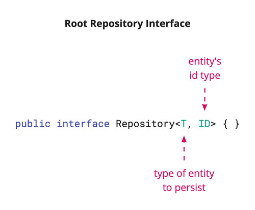
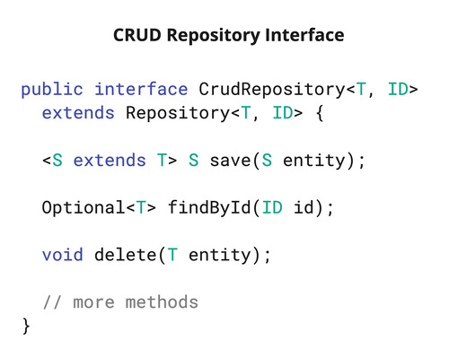
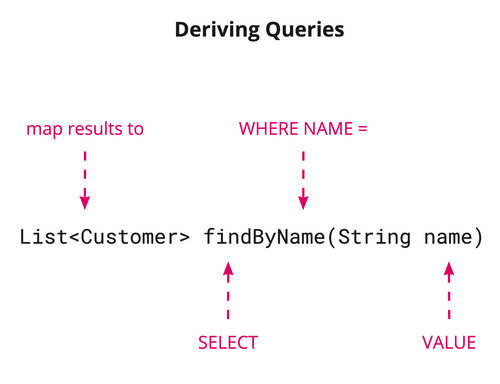
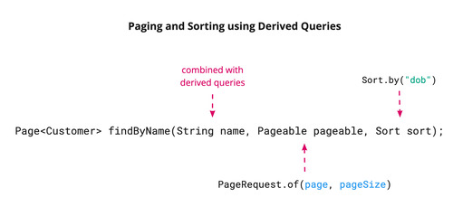
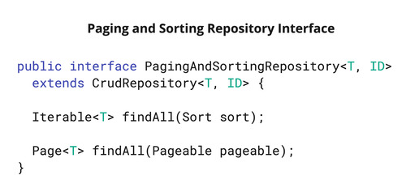
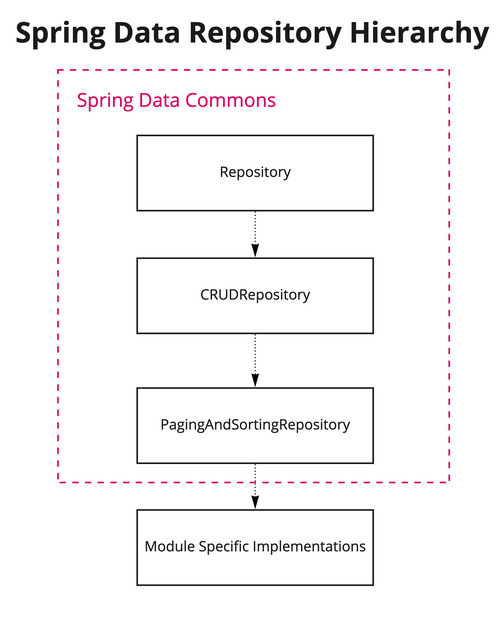

# Spring Data JDBC

Spring Data JDBC is a module part of the family under Spring Data that helps implement JDBC-based repositories. 
Other modules in the Spring Data family are:

- Spring Data Commons (pivotal)
- Spring Data JPA (pivotal)
- Spring Data MongoDB (pivotal)
- Spring Data Redis (pivotal)
- Spring Data DynamoDB (community)
- Spring Data Neo4j (community)
- and more...

Spring Data JDBC aims at being conceptually easy. To achieve this, it does NOT offer caching, lazy loading, 
write behind, or many other features found in other ORMs. This makes Spring Data JDBC a simple, limited, opinionated ORM.

## What is Spring Data?

Spring Data is an umbrella project that covers a collection of data-access projects that share a common programming model. 
It provides a familiar and consistent Spring-based programming model independent of the underlying data store.

Benefits of using Spring Data are:

- Easy learning curve
- Easy integration with Spring Boot
- Less boilerplate

more details [here](https://spring.io/projects/spring-data)

Some abstractions provided by Spring Data are:

- CRUD: Automatically implements Repository Pattern with basic CRUD operations

- Derived Queries: Automatically implements methods from interface method name and parameters. 
Not all Spring Data Modules support this. For example, Spring Data JPA has support for derived queries, 
while Spring Data JDBC does not (yet). 

- Pagination and Sorting: Automatically implemented methods for paginating data. Available as extension to Derived Queries 
  or using interface `PagingAndSortingRepository`. Similar to Derived Queries, not all Spring Data Modules support this feature.

 

- Transactions: Support for `@Transactional` annotation from Spring Core

- Auditing: Automatically implements writing to data store who changed data and when

## Spring Data JDBC Demos

### Demo 1: CRUD Repository

see test: `should_perform_crud_operations`

### Demo 2: Querying Data

- see test: `should_find_flights_from_london`
- notice that Spring Data JDBC does not support Derived Queries yet

### Demo 3: Sorting Data

- Spring Data JDBC does not support Spring Data Sort yet. Cannot use `Sort` type in FindAll method 
or the `PaginationAndSortingRepository` interface.
- A workaround is to hardcode the `ORDER BY` clause in a `@Query` annotation
- see test: `should_sort_flights_by_origin`

### Demo 4: Paginating Data

- Spring Data JDBC does not support Spring Data Pagination yet. Cannot use `Pageable` type in FindAll method 
or the `PaginationAndSortingRepository` interface.
- A workaround is to hardcode the `LIMIT` and `OFFSET` clauses in a `@Query` annotation
- see test: `should_page_results`

### Demo 5: Repository Custom Implementation

- Custom repository implementation must be follow the naming convention `FooRepository` -> `FooRepositoryImpl`.
 For example, calling your implementation `DefaultFooRepository` won't work. Spring Data will not find the custom code.
- see test: `should_use_custom_implementation`

### Demo 6: Transactions

- Transactions are not really part of Spring Data, they belong to Spring Core. 
However, they are often used with Spring Data.
- see tests: `TransactionalTests`

### Demo 7: DDD Aggregates

- An aggregate is a cluster of objects that form a unit, which should always be consistent.
- An aggregate should always get persisted (and loaded) together. It has a single object, called the aggregate root, 
which is the only thing allowed to touch or reference the internals of the aggregate. The aggregate root is what gets 
passed to the repository in order to persist the aggregate.
- One repository per Aggregate, not one repository per table.
- How does Spring Data JDBC determine what is part of the aggregate and what isn’t? 
The answer is very simple: Everything you can reach from an aggregate root by following non-transient references 
is part of the aggregate.
- see test: `should_perform_crud_operations_on_aggregate`

### Demo 8: References

- Use ids instead of direct references to store in database link between aggregates.
- Spring Data JDBC does not support many-to-one or many-to-many relationships. In order to model these, use IDs. 
This encourages a clean modularization of the domain model.
- see test: `should_delete_books_without_deleting_authors`

### Demo 9: Auditing

- Spring Data provides sophisticated support to transparently keep track of who created or changed an entity and 
when the change happened. To benefit from that functionality, you have to equip your entity classes with 
auditing metadata that can be defined either using annotations or by implementing an interface.
- Usually, the annotation-based way of defining auditing metadata is preferred as it is less invasive and more flexible.
- To activate auditing, add annotation `@EnableJdbcAuditing` to your configuration
- see test: `should_save_auditing_fields_to_database`

### Demo 10: Lifecycle Events

Spring Data JDBC triggers events that get published to any matching ApplicationListener beans in the application context. 

Useful for logging/auditing, timestamping entities, running validations, etc.

Available Events:

- BeforeDeleteEvent
- AfterDeleteEvent
- BeforeConvertEvent
- BeforeSaveEvent
- AfterSaveEvent
- AfterLoadEvent

Run tests and look for entries in the standard output that look like: `>>>>> detected a relational event:`

This is configured by method `createLoggingListener`

### Demo 11: Entity Callbacks

The Spring Data infrastructure provides hooks for modifying an entity before and after certain methods are invoked. 
Those so called EntityCallback instances provide a convenient way to check and potentially modify an entity 
in a callback fashioned style.

see test: `should_use_entity_callback_to_change_destination_name`
see also configuration: `addFooToDestination`

### Demo 12: Logging

Spring Data JDBC does little to no logging on its own. Instead, the mechanics of JdbcTemplate to issue SQL statements provide logging. 

See DEBUG entries in tests output which are turned on by setting in application.properties: 

`logging.level.org.springframework.jdbc.core.JdbcTemplate=DEBUG`

## JDBC-related annotations

### @EnableJdbcRepositories

Spring Data JDBC requires this annotation to find custom repositories implementations. 
It will scan the package of the annotated configuration class for Spring Data repositories by default.
Only `FlightRepositoryTests` uses this annotation. For example, `OrderRepositoryTests` does not use it. 
When needed, without this annotation, one would see an error that looks like this: 
`Unable to retrieve @EnableAutoConfiguration base packages`

### @AutoConfigureDataJdbc

Tests require this annotation to properly configure underlying `JdbcTemplates`.

Without this annotation one would see an error that looks like this:

`No qualifying bean of type 'org.springframework.jdbc.core.namedparam.NamedParameterJdbcOperations' available`

## Reference Material

### Spring Blog

- [Introducing Spring Data JDBC](https://spring.io/blog/2018/09/17/introducing-spring-data-jdbc)
- [Spring Data JDBC, References, and Aggregates](https://spring.io/blog/2018/09/24/spring-data-jdbc-references-and-aggregates)

### Spring Docs

- [Spring Data Auditing](https://docs.spring.io/spring-data/jdbc/docs/current/reference/html/#auditing)
- [Lifecycle Events](https://docs.spring.io/spring-data/jdbc/docs/current/reference/html/#jdbc.events)
- [Entity Callbacks](https://docs.spring.io/spring-data/jdbc/docs/current/reference/html/#entity-callbacks)
- [Transaction Management](https://docs.spring.io/spring-framework/docs/4.2.x/spring-framework-reference/html/transaction.html)
- [MyBatis Integration](https://docs.spring.io/spring-data/jdbc/docs/current/reference/html/#jdbc.mybatis)

### GitHub

- [spring-data-jdbc](https://github.com/spring-projects/spring-data-jdbc)
- [spring-data-examples/jdbc](https://github.com/spring-projects/spring-data-examples/tree/master/jdbc)

### StackOverflow

- [Can I do pagination with spring-data-jdbc?](https://stackoverflow.com/questions/55570077/can-i-do-pagination-with-spring-data-jdbc)
- [PagingAndSortingRepository methods throw error when used with spring data jdbc](https://stackoverflow.com/questions/53088927/pagingandsortingrepository-methods-throw-error-when-used-with-spring-data-jdbc/53089091#53089091)

### Pluralsight

- [Spring Framework: Overview of Spring Data](https://app.pluralsight.com/library/courses/spring-framework-overview-spring-data/table-of-contents)

### Baeldung

- [Spring Data JPA @Query](https://www.baeldung.com/spring-data-jpa-query)
- [Introduction to AssertJ](https://www.baeldung.com/introduction-to-assertj)
